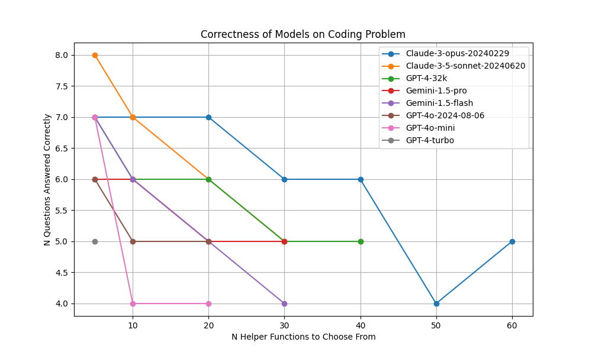
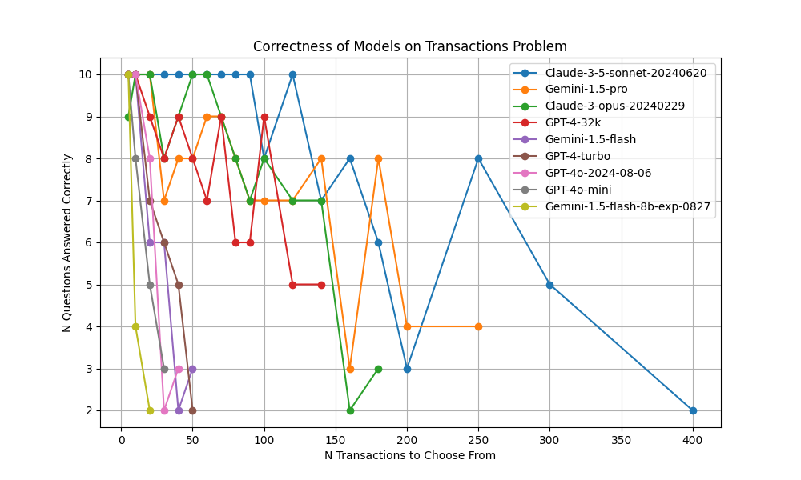

# LRCBench

Evals meant to evaluate language models' ability to reason over long contexts.

Currently, we support 3 settings with similar objectives:
- Coding: The model is given a coding question and a set of helper functions. It must select which (3) helper functions solve the problem.
- Transaction Matching: The model is given a set of accounting records, from which all but one can be paired according to the following criteria: a pair of records have opposite sign / same magnitude amounts, the same counterparty, and a date within 4 days. It must return the unpaired record.
- 2-cycle multiplication: The model is given a set of 2-cycles (from undergraduate group theory), and is asked to return the product of the two cycles in simplified form. (Note: Currently, LM models perform surprisingly poorly on this task.)

# Benchmarks

In order to make these Correctnesses more robust to noise, we stop after 2 consecutive runs that fail to reach 0.6.
We also increased the sample size for the coding benchmark, as it was a tad noisy.
I moved from gpt-4/gpt-4-32k to gpt-4-32k at all sizes, as gpt-4 is inferior to gpt-4-32k even up to 4k context. This improved the results for "gpt-4."

Score: The largest haystack size before the two consecutive runs that fail to reach 0.6.
Effective Context Window: The average token length of the haystack at the score.
Size at First Failure: The highest haystack size such that the model earned a full score up to and including that size.
Correctnesses: Int(correctness_percentage*100) for each haystack size up to the score.

## Helper Function Invocation - Data Science
Sample size: 30 problems
| LM | Score | Size at First Failure | Effective Context Window | Correctnesses |
|:----------|---------------:|:----------|---------------:|:----------|
| claude-3-opus-20240229 | 50 | 0 | 8933 | 7776645
| claude-3-5-sonnet-20240620 | 30 | 0 | 6393 | 87655
| gpt-4-32k | 30 | 0 | 6393 | 76655
| gemini-1.5-pro | 20 | 0 | 4900 | 6655
| gemini-1.5-flash | 20 | 0 | 4900 | 7654
| gpt-4o-2024-08-06 | 10 | 0 | 1123 | 655
| gpt-4o-mini | 10 | 0 | 1123 | 744
| gpt-4-turbo | 0 | 0 | 0 | 5

## Transaction Matching
Sample size: 10 problems
| LM | Score | Size at First Failure | Effective Context Window |Correctnesses |
|:----------|---------------:|---------------:|:----------|
| Claude-3-5-sonnet-20240620 | 400 | 80 | 13798 | TTTTTTTTTT8T7863852
| Gemini-1.5-pro | 200 | _* | _ | TTTT78899877783844
| Claude-3-opus-20240229 | 160 | 60 | 4982 | 9TT89TTT98787723
| GPT-4(-32k) | 120 | 20 | 3882 | TTT98987966955
| Gemini-1.5-flash | 40 | _ | _ | TTT6623
| GPT-4-turbo | 40 | 10 | 1388 | TTT7652
| GPT-4o-2024-08-06 | 30 | 10 | 1113 | TTT823
| GPT-4o-mini | 20 | 5 | 837 | TT853
| gemini-1.5-flash-8b-exp-0827 | 10 | 5 | _ | TT42

* Previously 40 (gpt-4 only), now 100 (gpt-4-32k)
* I can no longer get Gemini models to run without getting failure responses from them (possibly due to safety filters?)

## 2-cycle multiplication (Possibly implemented poorly?)
Sample size: 10 problems
| LM | Score | Size at First Failure | Correctnesses |
|:----------|---------------:|:----------|:----------|
| GPT-4-turbo | 3 | 1 | T800
| Claude-3-5-sonnet-20240620 | 2 | 1 | T42
| Claude-3-opus-20240229 | 2 | 1 | T41
| GPT-4o-2024-08-06 | 2 | 1 | T12
| GPT-4o-mini | 2 | 1 | T50
| GPT-4(-32k) | 2 | 1 | T31
| Gemini-1.5-pro | 0 | 0 | 0
| Gemini-1.5-flash | 0 | 0 | 0
| gemini-1.5-flash-8b-exp-0827 | 0 | 0 | 5

* Previously 2 (gpt-4 only), now 1 (gpt-4-32k)